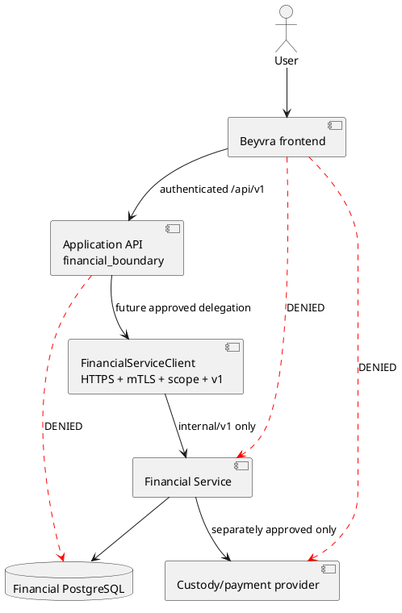

# Financial trust boundary

Financial Service is sole financial authority. Application PostgreSQL may hold request metadata, inbox/outbox, incidents, and projections, never authoritative balances or effects. The legacy local ledger is quarantined and is not a permissible future activation path. No Financial database hostname, owner, migrator, service-role credential, or SQL appears in application configuration.

Canonical intent events commit to the application PostgreSQL transactional
outbox. Financial Service/provider events enter only through the tenant-bound
idempotent inbox. These tables contain intent and projection evidence, never
balances, postings, or authoritative settlement state.

`financial_audit` is append-only in application code and through a PostgreSQL
`BEFORE UPDATE OR DELETE` trigger. Audit records contain bounded safe metadata
and hashes, not provider payloads, credentials, or private Financial database
identifiers.

Private financial realtime topics use exact authenticated-subject channel
ownership. Projection cursors are partitioned by tenant, subject, and event
type. Sequence gaps require canonical snapshot replacement; they cannot be
treated as successful incremental updates. See `FINANCIAL-REALTIME.md`.
