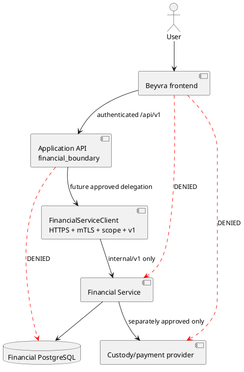

# Financial trust boundary

Financial Service is sole financial authority. Application PostgreSQL may hold request metadata, inbox/outbox, incidents, and projections, never authoritative balances or effects. The legacy local ledger is quarantined and is not a permissible future activation path. No Financial database hostname, owner, migrator, service-role credential, or SQL appears in application configuration.
