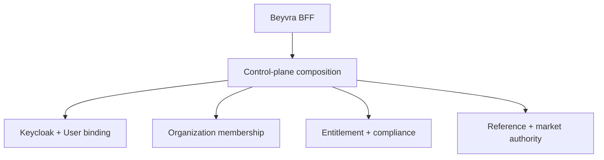

# Beyvra control plane and market-data authority

Status: candidate architecture, fail-closed, simulation only  
Contract: `2026-08-27.v1`

## Purpose

The Beyvra BFF exposes one customer-safe composition endpoint at
`GET /api/v1/control-plane/context`. The endpoint owns no business state. It
selects one authorized tenant and composes the decisions already owned by the
identity, tenant, pricing, compliance, reference-data, provider-governance, and
market-normalization domains.

## Single owners

| Concern | Canonical owner | Control-plane behavior | Duplicate policy |
|---|---|---|---|
| Human credentials, login, MFA, recovery | Keycloak | Reports whether the local account is bound | The backend never stores a second Keycloak password |
| Local identity read model | `users.User` | Returns only the caller's safe account fields | Issuer plus subject is unique when present |
| Tenant | `integrations.Organization` | Returns one active selected tenant | No tenant model is added to the control plane |
| Tenant access and role | `integrations.OrganizationMembership` | Requires active membership and active organization | Account plus organization is unique; ambiguous selection is rejected |
| Account plan and entitlements | `pricing_authority` | Resolves effective decisions for the selected tenant | One current plan per account and tenant; one result per entitlement code |
| KYC, AML, sanctions, jurisdiction and eligibility | `apps.compliance` | Evaluates without persisting a decision during GET | One profile per organization and user |
| Instruments and provider symbols | `reference_data` | Counts and resolves active, effective mappings | Provider symbol identity and canonical instrument constraints remain authoritative |
| Provider activation | `provider_governance` | Reports governed provider count; does not activate providers | Approval evidence is separate from symbol mapping |
| Normalization, provenance and freshness | `trade.market_authority` | Market APIs reject stale, suspect or unavailable data | Canonical quote/trade/status rows are projections, not an instrument registry |
| Cross-domain composition | `integrations.control_plane` | Read-only response composition | No models, migrations, writes or policy decisions |

## Tenant selection contract

1. A service token is bound to its organization.
2. A browser may select a tenant only with `X-Organization-ID`.
3. A single active membership is selected automatically.
4. Multiple active memberships without the header return
   `TENANT_SELECTION_REQUIRED`.
5. Inactive organizations and memberships are denied.
6. Request bodies never select tenancy.
7. The staging fallback uses a deterministic UUID, so concurrent requests
   cannot create duplicate fallback tenants.

The legacy `GET /api/v1/tenant/context` route delegates to the same resolver and
returns deprecation, sunset and successor headers. It is not a separate tenant
authority.

## Entitlement contract

- Current plan assignment is unique by `(account, tenant_ref)`.
- Account overrides carry the same `tenant_ref` and cannot cross tenants.
- Effective dates and active states are enforced for plans, plan versions,
  entitlements, assignments and overrides.
- If a tenant is not supplied and more than one current assignment exists, the
  resolver returns `DENY` with `tenant-ambiguous-v1`.
- Real trading, real money, deposits, withdrawals and transfers remain globally
  denied in this candidate.

## Compliance contract

- Profile and requirements APIs use the selected tenant.
- The control-plane GET evaluates capabilities with `persist=False`.
- A missing profile returns explicit `COMPLIANCE_PROFILE_REQUIRED` denials.
- A denied compliance transition invalidates pending simulation orders only for
  the same subject and tenant. The legacy `default` projection is considered
  only for a subject with exactly one active tenant.

## Market-data contract

- `reference_data.Instrument` and `ProviderSymbolMapping` replace the hard-coded
  runtime instrument registry.
- A symbol that resolves to more than one canonical instrument is rejected as
  `INSTRUMENT_AMBIGUOUS`.
- An instrument without an active mapping to a governed provider is rejected as
  `INSTRUMENT_MAPPING_UNAVAILABLE`.
- The local demo table is compatibility-only and is reachable only when
  `DEMO_MARKET_FIXTURE_ENABLED` is explicitly true.
- Market APIs inherit `SessionBoundJWTAuthentication`, enabling the BFF
  HttpOnly `beyvra_access` cookie. Unsafe cookie-authenticated methods retain
  CSRF enforcement.
- Quotes, trades and market status must be fresh and nonsuspect. Absence of
  authority returns a 503 response; no value is fabricated.
- This change does not enable a provider, create credentials, place a live
  order, or change any runtime deployment.

## Required release gates

- Migration graph is clean and reversible.
- Tenant ambiguity, inactive membership, cross-tenant override and
  cross-tenant compliance tests pass.
- Control-plane GET produces no eligibility-decision records and no duplicate
  entitlement codes.
- Market endpoints accept the BFF cookie and reject ungoverned or unmapped
  instruments.
- Existing reference-data, pricing, compliance, trading, security and API
  schema suites pass.
