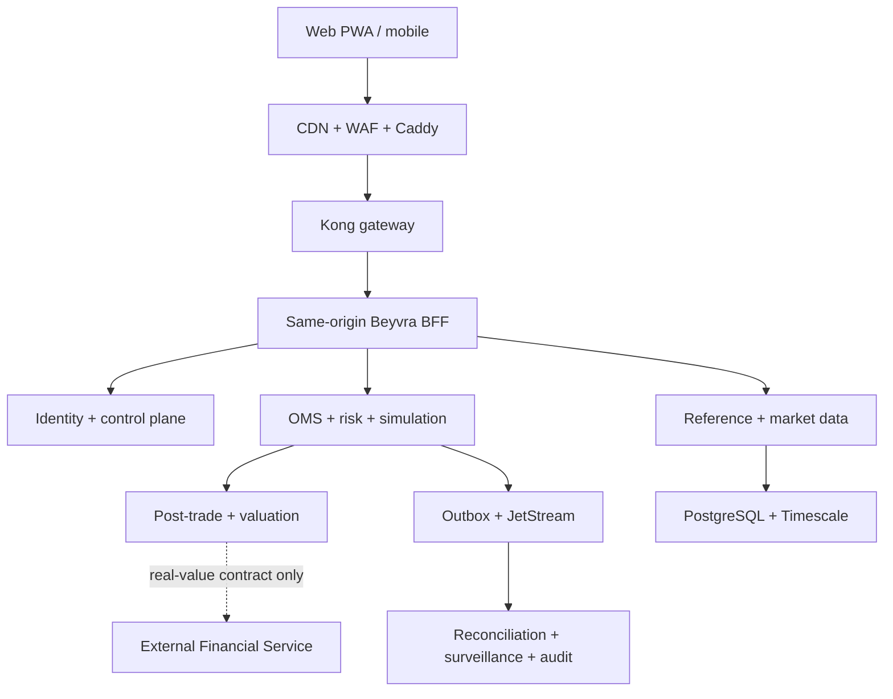

# Beyvra enterprise evolution plan

Status: implementation baseline, simulation-only. This document is not an
authorization to activate a broker, real funds, live settlement, production
email delivery, or a Keycloak client.

## Invariants

- The browser uses the same-origin BFF and HttpOnly session cookies. It does not
  read, decode, refresh, or persist access and refresh tokens.
- PostgreSQL is authoritative. Redis is limited to cache, leases and bounded
  session hints. NATS JetStream carries versioned events through an outbox.
- Beyvra owns orders, simulation positions and customer experience state. The
  external Financial Service remains the only authority for real cash, ledger
  posting and settlement finality.
- Market data, reference data, valuation and risk return explicit quality and
  provenance. Missing evidence is unavailable, never synthetic.
- Every real-value and external-execution capability is fail-closed. A live
  provider requires separate legal, security, financial, operational and
  maker-checker approval.

## Delivery sequence 1–9

1. **Identity convergence.** Complete the frontend Keycloak BFF cutover, prove
   exact issuer/audience/origin contracts, and remove browser-readable tokens.
   Administrator mutations require MFA on the current bound session.
2. **Product cleanup.** Remove non-Beyvra naming, loan/lender surfaces, obsolete
   routes and competing state/chart implementations behind compatibility
   telemetry and explicit sunset dates.
3. **Unified experience system.** Ship shared tokens, accessible components,
   route-addressable workspace state, tenant-scoped watchlists and alerts, and
   consistent empty/loading/error/degraded states.
4. **Governed market data.** Certify provider entitlements, instrument mapping,
   provenance, freshness, gap detection, replay and degraded-mode behavior
   before a provider can be enabled.
5. **Simulation journey.** Certify watchlist → chart → preview → risk decision →
   order → fill → position → P&L → statement with idempotency and reconciliation.
6. **Operations and risk.** Provide MFA-protected order, halt, provider health,
   unresolved outcome, surveillance, incident and append-only audit projections.
   Ambiguous execution remains unresolved until independent evidence exists.
7. **Mobile/PWA.** Deliver responsive Home, Markets, Trade, Portfolio and Account
   navigation, an installable shell, safe read caching and explicit offline
   order blocking. Native applications remain a later client of the same BFF.
8. **Release governance.** Require contract/security/regression gates, immutable
   digest deployments with SBOM/provenance, runtime smoke checks, automatic
   rollback and periodic restore/rollback exercises.
9. **Separately approved pilot.** Introduce no live behavior in normal feature
   work. A pilot can begin only after provider, legal, Keycloak, financial,
   market-data, reconciliation, observability, rollback and signed owner/security
   gates all pass against one exact release SHA and image digest.

## Service topology

## Canonical command path

Order submission remains REST, never GraphQL. The UI first calls
`POST /api/v1/trading/orders/preview`, shows the risk and price evidence, then
submits `POST /api/v1/trading/orders` with an `Idempotency-Key` and explicit
`X-Beyvra-Simulation-Mode: true`. WebSocket `/ws/v1/` compatibility remains in
place while `/ws/v2/` publishes account-scoped projections.

The supported state machine is `PENDING → ACCEPTED → OPEN → PARTIALLY_FILLED →
FILLED`, with cancel, reject and expiry terminal paths. External execution may
add `UNKNOWN`, but must route that outcome into reconciliation instead of
guessing whether an order exists at a venue.

## This baseline

The first enterprise API baseline adds tenant-scoped watchlists, canonical
alerts, portfolio summary/performance/allocation/risk projections, MFA-protected
operator orders/halts/provider health/reconciliation breaks/audit projections,
explicit unavailable advanced risk outputs, expanded CORS contract headers,
and digest-locked deployments with BuildKit SBOM/provenance plus automatic
rollback on a failed readiness smoke test.
